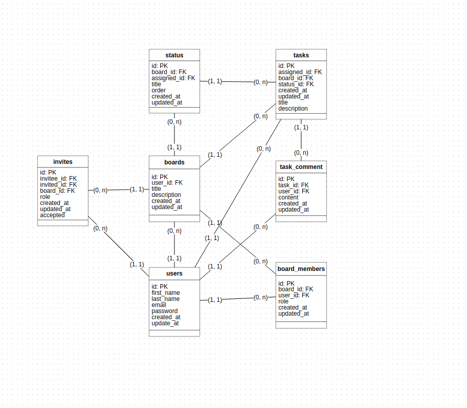

# 🏬 Kira Server

#### Kira is a project management tool inspired by Jira/Trello where users can create and manage their team, board, tasks and follow up on their project status. Created using Java 17, Spring Boot 6, Spring Data JPA, MySQL and Docker.

- [Table of Content](#table-of-content)
- [Non-Functional Requirements](#non-functional-requirements)
- [Kira Database Diagram](#kira-database-diagram)
- [How To Run](#how-to-run)
    - [Requirements](#functional-requirements)
    - [Running SuperSell Server](#-running-kira-server)
- [Tests](#tests)

### Non-Functional Requirements

- [ ] Kira Server should be developed using the following technologies: Java 17, Spring Boot, MySQL and Docker.
- [ ] Timestamp properties in MySQL tables.
- [ ] REST API should use prefix: '/api/v1/'
- [ ] Should feature a seeder for data.
- [ ] Docker container for the database.
- [ ] Docker container for the application.

### Functional Requirements
[Requirements documentation](docs/requirements.md)

### Kira Database Diagram


### Requirements

Before you start, you should have installed in your machine the following tools:
[Git](https://git-scm.com), [Java](https:///) and [Docker](https://www.docker.com/). Preferably Java version >= 17.
To edit the code you can use a code editor like [VSCode](https://code.visualstudio.com/).

### 🚀 Running Kira Server

- Clone this repository
```bash
git clone git@github.com:augustojs1/
```